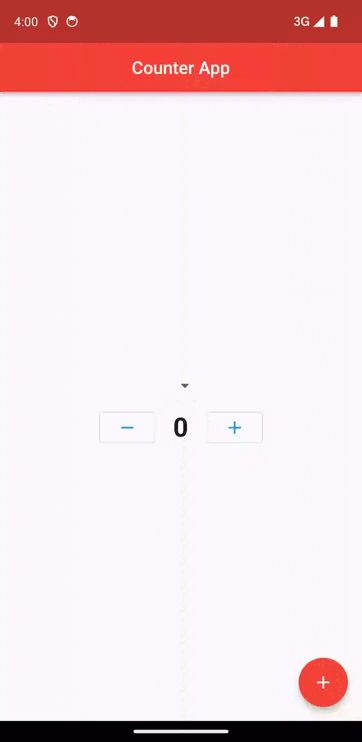

# Flutter Counter App




## Description

Flutter Counter is a simple yet powerful mobile application that allows users to track and manage their counting needs effortlessly. Whether you need to count steps, keep track of inventory, tally scores, or simply want a digital tally counter, Flutter Counter is the perfect tool for the job.

## Features

- Intuitive User Interface: Flutter Counter offers a clean and user-friendly interface, making it easy for users of all ages to count and keep track of their data.
- Increment and Decrement: Count up or down with a single tap on the screen, and watch the tally change in real time.
- User-friendly and intuitive design.
- Cross-platform compatibility (Android and iOS).
- No Internet Connection Required: The app is fully functional offline, ensuring you can count anytime and anywhere.

## Getting Started
Whether you're an athlete, teacher, event planner, or simply someone who needs to keep count, this versatile and easy-to-use app is a must-have tool for your smartphone or tablet. Start counting with ease, accuracy, and style with Flutter Counter.

1. **Prerequisites**: Make sure you have Flutter installed. If not, follow the [official Flutter installation guide](https://flutter.dev/docs/get-started/install).

2. **Clone the Repository**:

   ```bash
   git clone https://github.com/Badrudin-cloud/flutter_dicee_app.git
